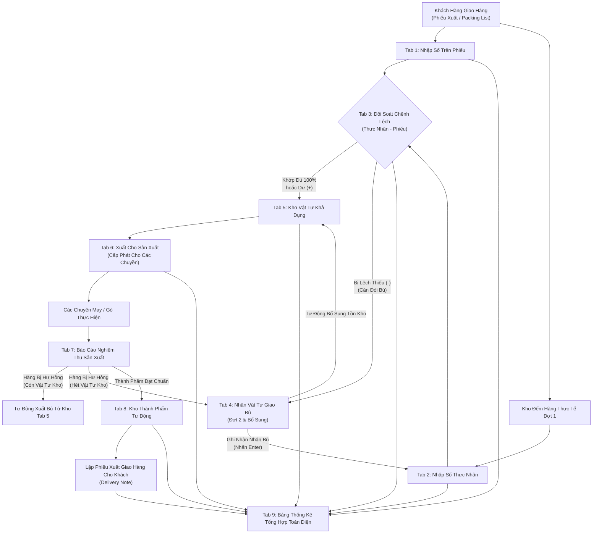

# SỔ TAY HƯỚNG DẪN SỬ DỤNG HỆ THỐNG
## PHẦN MỀM QUẢN LÝ KHO & SẢN XUẤT GIA CÔNG GIÀY D&D LONG AN
*(Phiên bản chuẩn hóa vận hành - Cập nhật 2026)*

---

## MỤC LỤC
1. [GIỚI THIỆU TỔNG QUAN HỆ THỐNG](#1-giới-thiệu-tổng-quan-hệ-thống)
2. [ĐỊA CHỈ TRUY CẬP VÀ MÔI TRƯỜNG LÀM VIỆC](#2-địa-chỉ-truy-cập-và-môi-trường-làm-việc)
3. [QUY TẮC THAO TÁC CHUẨN TRÊN TOÀN HỆ THỐNG](#3-quy-tắc-thao-tác-chuẩn-trên-toàn-hệ-thống)
4. [THANH ĐIỀU KHIỂN CHUNG (SIDEBAR BÊN TRÁI)](#4-thanh-điều-khiển-chung-sidebar-bên-trái)
5. [HƯỚNG DẪN CHI TIẾT TỪNG PHÂN HỆ NGHIỆP VỤ](#5-hướng-dẫn-chi-tiết-từng-phân-hệ-nghiệp-vụ)
   - [Tab 0: Khách Hàng & Cấu Hình Dải Size](#tab-0-khách-hàng--cấu-hình-dải-size)
   - [Tab 1: Số Trên Phiếu (Kế Hoạch Giao Hàng Đầu Vào)](#tab-1-số-trên-phiếu-kế-hoạch-giao-hàng-đầu-vào)
   - [Tab 2: Số Thực Nhận (Kho Kiểm Đếm Thực Tế Đợt 1)](#tab-2-số-thực-nhận-kho-kiểm-đếm-thực-tế-đợt-1)
   - [Tab 3: Số Chênh Lệch (Kiểm Soát Lệch Thừa / Thiếu Tự Động)](#tab-3-số-chênh-lệch-kiểm-soát-lệch-thừa--thiếu-tự-động)
   - [Tab 4: Nhận Vật Tư Giao Bù (Đợt 2 & Bổ Sung)](#tab-4-nhận-vật-tư-giao-bù-đợt-2--bổ-sung)
   - [Tab 5: Tồn Kho Thời Gian Thực (Kho Vật Tư Nguyên Phụ Liệu)](#tab-5-tồn-kho-thời-gian-thực-kho-vật-tư-nguyên-phụ-liệu)
   - [Tab 6: Xuất Cho Sản Xuất (Cấp Phát Vật Tư Cho Các Chuyền)](#tab-6-xuất-cho-sản-xuất-cấp-phát-vật-tư-cho-các-chuyền)
   - [Tab 7: Ghi Nhận Sản Xuất Xong (Nghiệm Thu & Xử Lý Hàng Hỏng)](#tab-7-ghi-nhận-sản-xuất-xong-nghiệm-thu--xử-lý-hàng-hỏng)
   - [Tab 8: Kho & Xuất Thành Phẩm (Quản Lý & Xuất Giao Khách Hàng)](#tab-8-kho--xuất-thành-phẩm-quản-lý--xuất-giao-khách-hàng)
   - [Tab 9: Bảng Thống Kê Tổng Hợp (Báo Cáo Đối Soát Toàn Diện)](#tab-9-bảng-thống-kê-tổng-hợp-báo-cáo-đối-soát-toàn-diện)
6. [SƠ ĐỒ LUỒNG DỮ LIỆU LIÊN THÔNG TỰ ĐỘNG](#6-sơ-đồ-luồng-dữ-liệu-liên-thông-tự-động)
7. [XỬ LÝ SỰ CỐ & CÂU HỎI THƯỜNG GẶP (FAQS)](#7-xử-lý-sự-cố--câu-hỏi-thường-gặp-faqs)

---

## 1. GIỚI THIỆU TỔNG QUAN HỆ THỐNG

Hệ thống Quản Lý Kho & Sản Xuất D&D Long An được thiết kế chuyên biệt cho mô hình **Gia công giày xuất khẩu (Footwear OEM)**. Hệ thống giải quyết trọn vẹn bài toán đối soát số lượng theo dải size từ lúc nhận vật tư khách giao đến khi sản xuất và xuất trả thành phẩm:

* **Quản lý theo Dải Size (Size Run)**: Mọi biểu mẫu, báo cáo, tồn kho đều linh hoạt theo dải size riêng biệt của từng khách hàng (ví dụ: Size `4, 5, 6, 7, 8, 9, 10, 11, 12, 13, 1L, 2L` hoặc `S, M, L, XL`).
* **Kiểm soát chênh lệch tự động**: So sánh tự động giữa Số trên chứng từ và Số thực tế đếm được.
* **Quy trình bù tinh gọn**: Khi giao thiếu hoặc hàng hỏng, hệ thống tự động ghi nhận số bù trực tiếp mà không cần làm thủ tục in ấn giấy tờ rườm rà.
* **Liên thông dữ liệu khép kín**: Số liệu từ Tab này tự động tính toán và phản ánh ngay sang các Tab khác theo thời gian thực (Real-time).

---

## 2. ĐỊA CHỈ TRUY CẬP VÀ MÔI TRƯỜNG LÀM VIỆC

1. **Địa chỉ trực tuyến (Online Cloud)**:  
   👉 **`https://production.ddlongan.workers.dev/`**  
   *(Sử dụng trên mọi máy tính, máy tính bảng, điện thoại có kết nối Internet)*

2. **Địa chỉ chạy nội bộ máy chủ tại xưởng (Local Server)**:  
   👉 **`http://localhost:3000/`**

> **Khuyến nghị trình duyệt**: Sử dụng trình duyệt **Google Chrome**, **Microsoft Edge**, hoặc **Cốc Cốc** để có trải nghiệm hiển thị và in ấn phiếu tốt nhất.

---

## 3. QUY TẮC THAO TÁC CHUẨN TRÊN TOÀN HỆ THỐNG

### ⌨️ A. Phím Tắt Tiện Lợi: Nhấn `Enter` Là Lưu Ngay
* Khi bạn nhập xong dữ liệu ở bất kỳ ô nhập liệu nào (Mã PO, Ngày tháng, Số lượng từng size, Diễn giải, Ghi chú), chỉ cần **nhấn phím `Enter` trên bàn phím**, hệ thống sẽ:
  1. Kiểm tra tính hợp lệ của dữ liệu.
  2. Tự động lưu dữ liệu vào hệ thống ngay lập tức.
  3. Hiển thị thông báo màu xanh xác nhận thành công.
* Giúp nhân viên thủ kho và kế toán thao tác liên tục bằng bàn phím số (Numpad) mà không cần phải nhấc tay dùng chuột bấm nút "Lưu".

### 🖱️ B. Các Biểu Tượng Thao Tác Chuẩn Trên Từng Dòng
Mỗi dòng dữ liệu trên bảng đều được trang bị các nút chức năng trực quan:

| Biểu Tượng | Tên Thao Tác | Ý Nghĩa & Cách Sử Dụng |
| :---: | :--- | :--- |
| ✏️ | **Chỉnh Sửa (Edit)** | Bấm vào để mở hộp thoại cho phép sửa toàn bộ thông tin dòng (Mã PO, Mã hàng, ngày tháng, số lượng từng size). Nhấn `Enter` để lưu sửa đổi. |
| 🗑️ | **Xóa Dòng (Delete)** | Bấm vào để xóa dòng dữ liệu đó. Hệ thống sẽ mở hộp thoại xác nhận ngay giữa màn hình để tránh việc bấm nhầm. |
| 🖨️ | **In Ấn (Print)** | Mở bản in phiếu đẹp mắt theo chuẩn A4/A5 để ký nhận hoặc lưu trữ hồ sơ. |
| 📥 | **Xuất Excel** | Tải toàn bộ dữ liệu đang xem ra file bảng tính Excel (`.xlsx`) phục vụ báo cáo nội bộ. |
| 📋 | **Dán Từ Excel** | Bấm nút "Dán Từ Excel", sau đó copy từ file Excel của bạn và dán vào ô, hệ thống tự động phân tích và điền vào các cột size. |

### 💬 C. Hộp Thoại Thông Báo Hiện Ngay Giữa Màn Hình (In-App Message Box)
* Hệ thống đã loại bỏ hoàn toàn các popup trình duyệt cũ gây khó chịu trên thanh địa chỉ.
* Các thông báo mới xuất hiện **nổi bật ngay giữa màn hình với nền mờ hiện đại**:
  * **Hộp thoại Thành công (Xanh lá)**: Xác nhận dữ liệu đã được lưu an toàn.
  * **Hộp thoại Cảnh báo (Vàng cam)**: Cảnh báo số lượng vượt tồn kho, thiếu thông tin bắt buộc.
  * **Hộp thoại Xác nhận (Xanh dương)**: Hỏi ý kiến xác nhận khi xóa hoặc sao chép dữ liệu (`[Hủy Bỏ]` hoặc `[Xác Nhận]`).
  * **Thông báo góc (Toast)**: Tự động biến mất sau 3 giây, không làm gián đoạn công việc nhập liệu.

### 📏 D. Đơn Vị Tính Đa Dạng
Hệ thống hỗ trợ đầy đủ các loại đơn vị tính chuyên ngành giày dép và may mặc:
* **`PRS`** hoặc **`đôi`** *(Phổ biến nhất cho giày thành phẩm & đế)*
* **`bộ`**, **`chiếc`**, **`cái`** *(Chi tiết may, lót giày)*
* **`mét`**, **`cuộn`**, **`sf`** *(Square Feet - Da tấm)*, **`yard/yds`** *(Vải may, chỉ)*
* **`kg`** *(Keo, hóa chất, phụ gia)*

---

## 4. THANH ĐIỀU KHIỂN CHUNG (SIDEBAR BÊN TRÁI)

Thanh cột dọc bên trái màn hình luôn cố định để quản lý phạm vi làm việc:

1. **Khách Hàng (Customer Switcher)**:
   * Chọn khách hàng đang làm việc (Ví dụ: `Deawoong (DW)`, `Liên Thái`,...).
   * **Quy tắc vàng**: Khi bạn đổi khách hàng, toàn bộ các bảng ở tất cả các Tab bên phải sẽ **tự động chuyển sang dữ liệu và dải size riêng của khách hàng đó**. Tránh hoàn toàn việc nhầm lẫn dữ liệu giữa các đối tác.
2. **Dải Size Áp Dụng**:
   * Hiển thị trực quan danh sách các size của khách hàng đang chọn (Ví dụ: `4, 5, 6, 7, 8, 9, 10, 11, 12, 13, 1L, 2L`).
   * Tất cả các bảng nhập liệu từ Tab 1 đến Tab 9 sẽ tự động tạo đúng số cột theo dải size này.
3. **Kỳ Lọc Báo Cáo (`Từ ngày - Đến ngày`)**:
   * Nhập khoảng ngày để xem dữ liệu phát sinh trong kỳ (Định dạng: `DD/MM/YYYY`, ví dụ: `01/09/2026` đến `30/09/2026`).
4. **Nút "Khôi Phục Mẫu"**:
   * Dùng khi bạn muốn đưa hệ thống về lại dữ liệu mẫu ban đầu để đào tạo nhân viên mới. Hệ thống sẽ có hộp thoại xác nhận trước khi thực hiện.

---

## 5. HƯỚNG DẪN CHI TIẾT TỪNG PHÂN HỆ NGHIỆP VỤ

```
[Tab 0] Khách Hàng & Dải Size
   └── [Tab 1] Số Trên Phiếu (Kế hoạch KH giao)
          └── [Tab 2] Số Thực Nhận (Kho đếm thực tế)
                 └── [Tab 3] Số Chênh Lệch (So sánh tự động Tab 2 - Tab 1)
                        └── [Tab 4] Nhận Vật Tư Giao Bù (Giao bù đợt 2)
                               └── [Tab 5] Tồn Kho Thời Gian Thực
                                      └── [Tab 6] Xuất Cho Sản Xuất (Cấp cho Chuyền)
                                             └── [Tab 7] Báo Cáo Nghiệm Thu Sản Xuất
                                                    └── [Tab 8] Kho & Xuất Thành Phẩm
                                                           └── [Tab 9] Bảng Tổng Hợp
```

---

### Tab 0: Khách Hàng & Cấu Hình Dải Size
* **Mục đích**: Khai báo danh mục đối tác gia công và quy định dải size áp dụng cho từng đối tác.
* **Cách sử dụng**:
  1. Bấm nút **`+ Thêm Đối Tác Mới`**.
  2. Nhập: Tên công ty, Mã viết tắt (VD: `DW`), Ghi chú.
  3. Cấu hình Dải Size: Nhập các size cách nhau bởi dấu phẩy hoặc khoảng trắng (VD: `4, 5, 6, 7, 8, 9, 10, 11, 12` hoặc `S, M, L, XL`).
  4. Nhấn **`Lưu Lại` (Enter)**.
  5. Khi cần sửa thông tin hoặc dải size của khách hàng, bấm biểu tượng cây bút ✏️ ở danh sách khách hàng.

---

### Tab 1: Số Trên Phiếu (Kế Hoạch Giao Hàng Đầu Vào)
* **Mục đích**: Ghi nhận số lượng vật tư nguyên phụ liệu mà khách hàng cam kết giao theo Phiếu xuất kho hoặc Packing List của đối tác.
* **Cách sử dụng**:
  * **Cách 1 - Nhập tay**:
    1. Điền: Ngày nhập, Mã PO (ví dụ: `AS-26.015`), Mã Hàng (`FT-0926`), Số phiếu giao hàng của KH, Diễn giải vật tư, Chọn ĐVT (`PRS`, `cuộn`, `sf`, `yard/yds`,...).
    2. Nhập số lượng tương ứng vào từng ô size.
    3. Nhấn **`Enter`** (hoặc bấm `LƯU ĐƠN HÀNG`): Dòng sẽ được lưu ngay vào bảng bên dưới.
  * **Cách 2 - Dán từ Excel (Nhanh nhất)**:
    1. Bấm nút **`Dán từ Excel`**.
    2. Copy các cột dữ liệu từ bảng tính Excel của bạn (theo đúng thứ tự cột gợi ý).
    3. Dán vào khung và bấm **`Phân Tích & Nạp Dữ Liệu`**. Toàn bộ danh sách sẽ vào bảng ngay.
* **Chỉnh sửa / Xóa**: Dưới bảng danh sách đã lưu, mỗi dòng đều có nút ✏️ Sửa và 🗑️ Xóa.

---

### Tab 2: Số Thực Nhận (Kho Kiểm Đếm Thực Tế Đợt 1)
* **Mục đích**: Ghi nhận số lượng vật tư thực tế mà thủ kho đếm được khi xe giao hàng tới xưởng trong Đợt 1.
* **Cách sử dụng**:
  * Danh sách đơn hàng từ Tab 1 sẽ tự động xuất hiện tại đây để thủ kho đối chiếu.
  * **Nhập số đếm thực tế**: Gõ số lượng thực nhận vào từng ô size. Nhấn **`Enter`** là hệ thống lưu ngay.
  * **Tính năng sao chép 100% (Nếu khách giao đủ)**:
    * Bấm nút **`Sao Chép Từ Phiếu (100%)`** ở từng dòng: Điền toàn bộ số lượng trên phiếu sang thực tế chỉ bằng 1 cú nhấp chuột.
  * **Dán từ Excel**: Hỗ trợ dán bảng kiểm đếm từ file Excel. Hệ thống sẽ tự động đối soát Mã PO, nếu có mã nào sai lệch sẽ lập tức đánh dấu màu đỏ để thủ kho kiểm tra lại.
  * **Nút Sửa ✏️ & Reset 🗑️**: Cho phép đưa số thực nhận về 0 để đếm lại từ đầu khi cần.

---

### Tab 3: Số Chênh Lệch (Kiểm Soát Lệch Thừa / Thiếu Tự Động)
* **Mục đích**: Hệ thống tự động so sánh giữa **Số thực nhận (Tab 2)** và **Số trên phiếu (Tab 1)**:
  $$\text{Chênh Lệch} = \text{Số Thực Nhận} - \text{Số Trên Phiếu}$$
* **Quy ước màu sắc trực quan**:
  * 🔴 **Ô Màu Đỏ / Số Âm (-)**: Khách hàng **giao thiếu**. Cần đòi bù!
  * 🟢 **Ô Màu Xanh / Số Dương (+)**: Khách hàng **giao thừa**.
  * ⚪ **Số 0 / Dấu gạch (-)**: Khớp đủ 100%.
* **Điều hướng thông minh**:
  * Khi có bất kỳ mã hàng nào bị lệch âm, hệ thống sẽ hiện nút màu đỏ nổi bật:  
    👉 **`Sang Tab 4 Nhận Bù Vật Tư (X đơn) ➔`**  
    Bấm vào để chuyển ngay sang phân hệ nhận bù.

---

### Tab 4: Nhận Vật Tư Giao Bù (Đợt 2 & Bổ Sung)
*(Đã chuẩn hóa tinh gọn theo quy trình mới - Bỏ thủ tục in ấn bắt buộc)*

* **Bối cảnh**: Khi bên giao hàng bị thiếu vật tư ở Đợt 1 (phát hiện ở Tab 3), xưởng thông báo và đối tác sẽ chở hàng sang bù đợt 2. Quá trình này **không cần in phiếu bù hay làm thủ tục rườm rà**, thủ kho chỉ cần ghi nhận số lượng thực tế nhận bù vào hệ thống.
* **Cách sử dụng**:
  1. **Trường hợp nhận đủ 100% số thiếu**:
     * Tìm đến dòng đơn hàng đang thiếu ➔ Bấm nút **`Nhận Đủ 100%`** màu xanh.
     * Hệ thống tự động điền đủ số lượng thiếu và hoàn tất ngay.
  2. **Trường hợp đối tác giao bù từng phần (nhiều đợt)**:
     * Bấm nút **`Ghi Số Bù`** màu xanh dương.
     * Nhập số lượng thực tế nhận bổ sung vào từng size.
     * Nhấn **`Lưu Số Nhận Bù` (Enter)**.
* **Tác động tự động đến toàn hệ thống**:
  * Ngay khi bạn bấm lưu nhận bù, số lượng bù sẽ **tự động cộng dồn vào Số Thực Nhận ở Tab 2**.
  * Chênh lệch âm ở **Tab 3 tự động biến mất** (trở về trạng thái khớp đủ).
  * Số lượng vật tư trong kho ở **Tab 5 tự động tăng lên tương ứng**.
* **Chỉnh sửa ngày đề nghị**: Bạn có thể bấm trực tiếp vào ô ngày để sửa và nhấn `Enter` để lưu.
* **Nguồn phát sinh**: Hệ thống phân loại rõ 3 nguồn:
  * `Giao thiếu (Tab 3)`: Bù cho phần giao thiếu ban đầu.
  * `Hàng hư hỏng`: Bù cho vật tư bị hỏng trong xưởng.
  * `Hỏng hết kho (Tab 7)`: Bù khi chuyền làm hỏng mà kho đã cạn vật tư.

---

### Tab 5: Tồn Kho Thời Gian Thực (Kho Vật Tư Nguyên Phụ Liệu)
* **Mục đích**: Quản lý số lượng vật tư nguyên phụ liệu đang thực sự có trong kho xưởng, sẵn sàng cấp phát cho các chuyền may, gò, hoàn thiện.
* **Công thức tính toán tự động**:
  $$\text{Tồn Kho Khả Dụng} = \text{Thực Nhận (Tab 2)} + \text{Nhận Bù (Tab 4)} - \text{Đã Cấp Sản Xuất (Tab 6)}$$
* **Tính năng**:
  * Tra cứu nhanh theo Mã PO, Mã Hàng, Tên vật tư.
  * Xem chi tiết số lượng tồn theo từng size.
  * Cảnh báo ô màu đỏ khi tồn kho về 0 hoặc bị âm.
  * Xuất báo cáo tồn kho vật tư ra Excel hoặc In thẻ kho.

---

### Tab 6: Xuất Cho Sản Xuất (Cấp Phát Vật Tư Cho Các Chuyền)
* **Mục đích**: Quản lý các đợt xuất cấp phát vật tư từ kho giao cho các tổ/chuyền sản xuất (Chuyền 1, Chuyền 2, Tổ May A, Tổ Gò,...).
* **Cách sử dụng**:
  1. Chọn Mã PO và Mã Hàng cần xuất (hệ thống tự động hiển thị số lượng tồn kho khả dụng để tham chiếu).
  2. Chọn Chuyền nhận (VD: `Chuyền 1`).
  3. Nhập số lượng cấp phát cho từng size.
  4. Nhấn **`LƯU PHIẾU XUẤT (ENTER)`**.
* **Kiểm soát an toàn**: Hệ thống tự động khóa và cảnh báo nếu người dùng nhập số lượng xuất **vượt quá số lượng đang có trong kho**.
* **Lịch sử xuất**: Phía dưới lưu trữ đầy đủ sổ nhật ký cấp phát. Có nút ✏️ Sửa và 🗑️ Xóa (khi xóa phiếu xuất, vật tư sẽ tự động hoàn trả lại vào Tồn kho Tab 5).

---

### Tab 7: Ghi Nhận Sản Xuất Xong (Nghiệm Thu & Xử Lý Hàng Hỏng)
* **Mục đích**: Ghi nhận kết quả sau khi các chuyền sản xuất xong: Bao nhiêu đôi đạt chuẩn nhập kho, bao nhiêu đôi bị lỗi/hư hỏng trong quá trình may, gò.
* **Cách sử dụng**:
  1. Chọn Mã PO, Mã Hàng, Chuyền báo cáo (VD: `Chuyền 2`).
  2. **Dòng 1 - Số lượng hoàn thành đạt**: Nhập số đôi thành phẩm làm ra đạt chất lượng theo từng size.
  3. **Dòng 2 - Số lượng làm hư hỏng**: Nhập số lượng bị lỗi, hỏng (nếu có).
  4. Nhập lý do hư hỏng (VD: `Lệch màng ép nhiệt, lỗi dao dập,...`).
  5. Nhấn **`LƯU NGHIỆM THU (ENTER)`**.
* **Cơ chế xử lý tự động cực kỳ thông minh**:
  * **Đối với thành phẩm đạt**: Hệ thống **tự động chuyển thẳng vào Kho Thành Phẩm (Tab 8)** để chuẩn bị xuất giao khách hàng!
  * **Đối với hàng bị hư hỏng**:
    * *Trường hợp 1 (Kho còn vật tư)*: Hệ thống tự động xuất bù từ kho ra cho chuyền làm lại ➔ Trừ tồn kho Tab 5 với ghi chú "Xuất bù hàng hỏng".
    * *Trường hợp 2 (Kho hết vật tư)*: Hệ thống tự động đẩy dữ liệu sang **Tab 4 (Nhận Vật Tư Giao Bù)** với nguyên nhân `Hàng hư hỏng` để theo dõi đòi khách hàng cấp thêm.

---

### Tab 8: Kho & Xuất Thành Phẩm (Quản Lý & Xuất Giao Khách Hàng)
*(Phân hệ mới bổ sung hoàn chỉnh quy trình)*

Phân hệ gồm 3 phân khu chuyên biệt:

#### Phân Khu 1: Bảng Tồn Kho Thành Phẩm (Đọc Tự Động Từ Tab 7)
* Hệ thống tự động tổng hợp toàn bộ số lượng giày đạt chuẩn từ Tab 7.
* Bảng hiển thị 3 dòng rõ ràng cho từng PO:
  * `Dòng 1`: Đã nhập kho từ các Chuyền sản xuất xong.
  * `Dòng 2`: Đã xuất giao cho khách hàng các đợt trước.
  * `Dòng 3 (Nổi bật)`: **TỒN KHO THÀNH PHẨM HIỆN TẠI** (Sẵn sàng đóng thùng giao khách).
* Nút tắt **`Xuất Giao`**: Bấm vào để lập tức mở form xuất cho đúng mã PO đó.

#### Phân Khu 2: Lập Phiếu Xuất Giao Thành Phẩm Cho Khách Hàng
1. Chọn PO / Mã hàng cần xuất.
2. Nhập: Ngày xuất, Số phiếu xuất (`Voucher`, ví dụ: `XKTP-0926-001`), Người hoặc Đơn vị nhận hàng.
3. Nhập số lượng xuất theo từng size (hoặc bấm nút *"Điền xuất hết toàn bộ tồn kho"* nếu giao sạch kho).
4. Nhấn **`LƯU & XUẤT KHO THÀNH PHẨM (ENTER)`**.
* *Lưu ý*: Hệ thống kiểm tra số tồn kho thành phẩm, không cho phép xuất vượt quá số lượng giày thực có trong kho.

#### Phân Khu 3: Sổ Nhật Ký Các Đợt Xuất Kho Thành Phẩm
* Lưu trữ toàn bộ lịch sử các chuyến hàng đã giao cho khách.
* Trên từng dòng có đủ 3 nút thao tác:
  * 🖨️ **In Phiếu (Delivery Note)**: In Phiếu Xuất Kho Giao Hàng Thành Phẩm chuyên nghiệp có đủ nơi ký của Thủ kho, Người nhận hàng, Quản đốc xưởng.
  * ✏️ **Chỉnh Sửa**: Mở hộp thoại sửa lại phiếu xuất khi có điều chỉnh (hỗ trợ Enter lưu ngay).
  * 🗑️ **Xóa Phiếu**: Khi xóa phiếu xuất nhầm, toàn bộ số lượng giày sẽ **tự động được trả lại vào Tồn Kho Thành Phẩm** ngay lập tức!
* Hỗ trợ nút **`Xuất Excel`** sổ giao hàng thành phẩm.

---

### Tab 9: Bảng Thống Kê Tổng Hợp (Báo Cáo Đối Soát Toàn Diện)
* **Mục đích**: Bảng điều khiển trung tâm (Master Dashboard) gom toàn bộ số liệu của cả nhà xưởng trên một màn hình:
  * **Kế hoạch trên phiếu (Tab 1)**
  * **Thực tế kho nhận (Tab 2)**
  * **Chênh lệch thừa thiếu (Tab 3)**
  * **Vật tư đã xuất cho Chuyền (Tab 6)**
  * **Tồn kho vật tư khả dụng (Tab 5)**
  * **Thành phẩm sản xuất xong & Đã xuất giao khách (Tab 8)**
* **Chế độ xem linh hoạt**:
  * **Chế độ Ma Trận (Chi tiết dải size)**: Xem rõ từng size từ 4 đến 12.
  * **Chế độ Rút Gọn (1 Dòng)**: Thu gọn mỗi PO thành 1 dòng để báo cáo nhanh cho Ban Giám Đốc.
* **Bộ lọc thông minh**:
  * Lọc xem tất cả.
  * Chỉ xem các đơn đang bị **Lệch Thiếu (Cần Bù)**.
  * Chỉ xem các đơn **Đang Còn Tồn Kho**.
* **In & Xuất Excel**: In Báo Cáo Tổng Hợp A4 hoặc tải file Excel tổng hợp hoàn chỉnh chỉ bằng 1 cú nhấp chuột.

---

## 6. SƠ ĐỒ LUỒNG DỮ LIỆU LIÊN THÔNG TỰ ĐỘNG



---

## 7. XỬ LÝ SỰ CỐ & CÂU HỎI THƯỜNG GẶP (FAQS)

### ❓ Câu hỏi 1: Tôi vừa truy cập trang web nhưng thấy giao diện chưa có tính năng mới?
* **Nguyên nhân**: Trình duyệt Chrome của bạn đang lưu bộ nhớ đệm (Cache) của phiên bản web cũ.
* **Cách khắc phục**:
  * Cách 1: Trên bàn phím máy tính, nhấn tổ hợp phím **`Ctrl + F5`** (hoặc **`Ctrl + Shift + R`**) để xóa cache và tải lại trang mới nhất.
  * Cách 2: Mở một cửa sổ ẩn danh bằng **`Ctrl + Shift + N`** và truy cập lại `https://production.ddlongan.workers.dev/`.

### ❓ Câu hỏi 2: Khi dán dữ liệu từ Excel vào Tab 1 hoặc Tab 2 bị lỗi không nhận cột?
* **Cách khắc phục**:
  1. Đảm bảo thứ tự các cột trong file Excel của bạn khớp với mẫu hiển thị trong khung hướng dẫn của nút "Dán Từ Excel".
  2. Không copy dòng tiêu đề (Header), chỉ copy các dòng dữ liệu số.
  3. Đảm bảo các ô số lượng không chứa ký tự lạ hoặc chữ cái.

### ❓ Câu hỏi 3: Nếu tôi lỡ xóa một Phiếu Xuất Kho Thành Phẩm ở Tab 8 thì sao?
* **Trả lời**: Bạn hoàn toàn yên tâm! Hệ thống được lập trình liên thông thông minh: Khi bạn xóa một phiếu xuất kho thành phẩm, toàn bộ số lượng giày của phiếu đó sẽ **tự động được cộng hoàn trả lại vào Tồn Kho Thành Phẩm ngay lập tức**, không làm thất thoát dữ liệu.

### ❓ Câu hỏi 4: Có thể chỉnh sửa ngày đề nghị bù ở Tab 4 được không?
* **Trả lời**: Hoàn toàn được! Bạn có thể:
  * Nhấp chuột trực tiếp vào ô ngày ở cột "Ngày Đề Nghị" trên bảng ➔ Gõ ngày mới ➔ Nhấn **`Enter`** là hệ thống lưu ngay.
  * Hoặc bấm nút cây bút ✏️ để mở hộp thoại sửa đầy đủ các thông tin.

### ❓ Câu hỏi 5: Dữ liệu của tôi được lưu ở đâu? Có bị mất khi tắt máy không?
* **Trả lời**: Hệ thống hoạt động theo cơ chế **Lưu trữ kép an toàn**:
  1. **Lưu trữ tức thì tại máy (Local Storage)**: Dữ liệu được lưu ngay vào trình duyệt máy tính, không bao giờ bị mất khi tải lại trang hoặc mất mạng đột ngột.
  2. **Đồng bộ tự động lên Đám mây Cloudflare (Database D1)**: Mọi thao tác lưu, sửa, xóa đều được đồng bộ lên cơ sở dữ liệu đám mây bảo mật cao của Cloudflare, giúp các thiết bị khác nhau trong công ty đều xem được số liệu chung.

---

> **HỖ TRỢ KỸ THUẬT & VẬN HÀNH**:  
> Đội ngũ Kỹ thuật D&D Long An luôn sẵn sàng hỗ trợ nâng cấp và tối ưu hóa tính năng theo yêu cầu thực tế của nhà xưởng.
